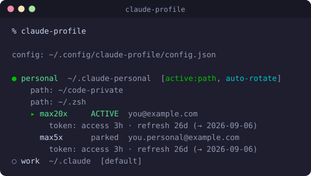
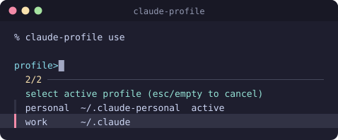
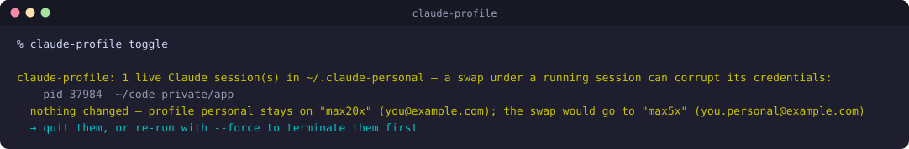

# claude-profile

Juggle multiple Claude subscriptions in [Claude Code](https://claude.com/claude-code) — the environment
comes across unchanged (memory, sessions, settings, per-project trust all
persist); only the credential changes underneath. A swap does need a Claude
restart (a running session keeps its old token), so it's a between-sessions
switch, not mid-session.

<div align="center">
  
</div>

Two composable modes:

- **Multi-profile** — several Claude Code config dirs (e.g. `~/.claude` for
  work, `~/.claude-personal` for personal), selected automatically by cwd
  path rules or toggled explicitly. Each dir is a fully separate identity:
  its own login, history, settings.
- **Serial accounts** — one config dir holding several *accounts*
  (subscriptions). Switching accounts swaps **only** the OAuth
  token/credentials — sessions, memory, settings, MCP servers, per-project
  trust all persist bit-for-bit. Exhaust one Max subscription, flip to the
  other, `claude --resume`, keep working. An **auto mode** rotates to the
  next non-exhausted account at launch.

The modes nest: a work machine can run a `work` profile plus a `personal`
profile whose two Max subscriptions rotate serially inside it.

Three words, used precisely throughout:

| | is | holds |
|---|---|---|
| **profile** | a config dir | the state — sessions, memory, settings, per-project trust |
| **account** | a subscription | the credential, i.e. whose quota a turn spends |
| **seat** | the profile + account *currently* in effect | what a label like `Personal (Max 5x)` names |

The split is the reason a swap is cheap: accounts change underneath a profile
that does not move, so nothing you have built up goes anywhere. It is also why
tools that read this one care about different halves — a session browser wants
the profile (that is where the transcripts are), a usage meter wants the account
(that is whose quota is being spent), and a statusline wants the seat.

## Why

- **Run out of quota, keep working.** Hit the rate limit on one Max plan, flip
  to another, `claude --resume`, carry on — same session, same context.
- **Your setup comes with you.** A swap changes *only* the OAuth token. Memory,
  sessions, settings, MCP servers, per-project trust all persist bit-for-bit.
- **Hands-off rotation.** `auto` mode rotates off an exhausted account at launch;
  exhaustion is read from Claude's own usage endpoint, and a launch is never
  blocked on a guess.
- **Spend credits before you switch.** `exhaust_credits` burns an account's
  overage credits first and rotates only when they're near-spent — no paid
  credits left on the table.
- **Work and personal, cleanly split.** Separate config dirs auto-selected by
  directory — and serial accounts nest *inside* each, so both axes compose.
- **Ages out loudly, not silently.** A launchd/systemd keep-alive daemon renews
  parked refresh tokens for as long as the server will extend them, and says so
  — log, `status`, and email — the moment it can't, so a re-login is a chore you
  schedule rather than a surprise mid-task (per-account opt-out).
- **Invisible until you need it.** No config, or the default `~/.claude`? The
  wrapper is a byte-identical passthrough. `\claude` bypasses it entirely.
- **Nothing to break, nothing to lose.** Secrets never hit argv; worst case
  (Claude changes internals) is a plain `/login` — the config dir is never at risk.

> Works on **macOS and Linux**. The credential store is platform-specific:
> the macOS login Keychain, or on Linux the `.credentials.json` files Claude
> Code itself uses (live: `<dir>/.credentials.json`; parked: mode-0600 files
> under the state dir). The keep-alive daemon is a launchd agent on macOS and
> a systemd `--user` timer on Linux. Everything else is identical.

## Install

Clone it anywhere — the wrapper self-locates, so `~/code` below is just an
example (nothing is hardcoded to a particular directory):

```sh
git clone https://github.com/deviationist/claude-profile ~/code/claude-profile
echo 'source ~/code/claude-profile/claude-profile.zsh' >> ~/.zshrc
cp ~/code/claude-profile/.env.example ~/code/claude-profile/.env   # optional knobs
```

Requirements: zsh, python3 (stdlib only). Credential store: the macOS Keychain
(uses `security`) or, on Linux, files — nothing extra to install on either.
Every launch also **warms claude-usage's caches** for the seat it resolved (when
that tool is installed): the statusline never blocks, and Claude Code paints it
once at startup, so a cold cache would show up as a missing segment until your
first message rather than a late one.

### Optional dependencies

**[`fzf`](https://github.com/junegunn/fzf) — recommended.** Every command that
takes a name (`use`, `account`, `auth`, `delete`) opens a picker when you omit
it, and with fzf that picker is fuzzy-searchable:

```sh
brew install fzf      # macOS
sudo apt install fzf  # Debian/Ubuntu
```

It is genuinely optional: **without fzf the same picker falls back to a
numbered prompt**, so nothing becomes unreachable — you type `2` instead of
filtering. The fallback nudges you once per shell that fzf exists; set
`CLAUDE_PROFILE_NO_FZF_HINT=1` to silence that.

**[`claude-usage`](https://github.com/deviationist/claude-usage)** — statusline
integration, auto-routed per profile; its `--all` renders a themed usage bar for
**every** account here via the `usage-json` porcelain, which refreshes parked
tokens so their usage stays visible.

## Configure

`~/.config/claude-profile/config.json` (`$XDG_CONFIG_HOME` respected, or set
`$CLAUDE_PROFILE_CONFIG` to relocate it) — you edit this by hand; the CLI
reads it:

```jsonc
{
  "default_profile": "personal",
  "profiles": {
    "personal": {
      "dir": "~/.claude",           // the Claude Code config dir
      "display": "Personal",        // OPTIONAL — this profile's half of the seat
                                    // label (see "Seat labels"); default: the key
      "paths": [],                  // cwd prefixes that auto-select this profile
      "accounts": ["max20x", "max5x"],  // credential slots (order = rotation order)
      "auto": true,                 // rotate off an exhausted account at launch
      "exhaust_credits": false      // false: swap at the rate limit. true: keep
                                    // burning this account's extra-usage credits
                                    // first, swap only when they're near-spent
                                    // (~99% — Claude stops just before the cap)
    }
  },
  "oauth": {                        // OPTIONAL — only for refresh/usage; see "OAuth constants"
    "client_id":  "<claude-code-oauth-client-id>",
    "token_url":  "<claude-code-token-endpoint-url>",
    "usage_url":  "<claude-code-usage-endpoint-url>",
    "user_agent": "<claude-code-user-agent>"
  },
  "keepalive": {                    // OPTIONAL — per-account; omitted account = kept alive (true)
    "max5x": false                  // don't auto-renew this account's refresh token
  },
  "account_display": {              // OPTIONAL — each account's half of that label
    "max20x": "Max 20x",            // omitted account renders as its own key
    "max5x":  "Max 5x"
  },
  "notify_email": "you@example.com" // OPTIONAL — email via the system `sendmail` if keep-alive fails
}
```

A dual-mode example — work machine with a personal profile running two Max
subscriptions serially:

```jsonc
{
  "default_profile": "work",
  "profiles": {
    "work":     { "dir": "~/.claude" },
    "personal": {
      "dir": "~/.claude-personal",
      "paths": ["~/code-private"],
      "accounts": ["max20x", "max5x"],
      "auto": true
    }
  }
}
```

Runtime state (active toggle, live account per profile, usage cache,
non-secret account metadata) lives in `~/.local/state/claude-profile/`
(`$XDG_STATE_HOME` respected). Parked credentials: on **macOS**, Keychain
items (`claude-profile-parked-<name>`), never on disk; on **Linux**,
mode-0600 files under the state dir (`parked/<name>.json`) — the same
protection as Claude Code's own `.credentials.json`.

A saved account is therefore **two** artifacts, and a swap needs both:

| Artifact | Where | Holds |
|---|---|---|
| parked credential | Keychain `claude-profile-parked-<name>` (macOS) / 0600 file (Linux) | the OAuth access + refresh token pair |
| snapshot | `accounts/<name>.json` in the state dir | `accountUuid`, `oauthAccount`, `userID`, `savedAt` |

"Parked" means *set aside while another account is live*: exactly one account
at a time owns the dir's live credential (the item Claude Code actually reads),
and the rest wait parked. The snapshot is what a swap writes into
`.claude.json` so Claude Code knows *which* account the incoming token belongs
to — a token alone doesn't say. `status` reports an account with only one of
the two as `UNSAVED`; the swap preflight names the missing half and offers to
re-run `auth`, which rewrites both.

### OAuth constants

The keep-alive `refresh` and per-account `usage` features talk to Claude
Code's OAuth endpoints, which require Claude Code's own OAuth **client id**,
token/usage **URLs**, and **User-Agent**. Those identify the official client
rather than this tool, so they are **not distributed here** — supply them per
machine in the `oauth` block above (or via the `CLAUDE_PROFILE_CLIENT_ID`,
`CLAUDE_PROFILE_TOKEN_URL`, `CLAUDE_PROFILE_USAGE_URL`, `CLAUDE_PROFILE_UA`
environment variables, which take precedence). Read the values from your own
Claude Code installation.

Everything else works without them: profile routing and account swapping are
fully functional; only `refresh`, `usage`, and exhaustion-based auto-rotation
go inert, and they fail with a clear message rather than silently.

## Use

### Launching

`claude` (the wrapped launcher) resolves the profile per launch:

1. caller-set `CLAUDE_CONFIG_DIR` — always honored, wrapper steps aside
2. cwd path rule (`paths`)
3. explicit toggle (`claude-profile use <name>`) — persists across shells
4. `default_profile`

When the resolved dir is `~/.claude` the wrapper sets nothing — behavior is
byte-identical to the bare binary (and with no config file the wrapper is a
transparent passthrough everywhere). `\claude` bypasses it entirely.

### CLI

Leave the name off any of the selection commands and you get a picker over
exactly what you have configured — profiles for `use`, accounts for `account` —
fuzzy with `fzf`, numbered without it:

<div align="center">
  
</div>

```
claude-profile                     status: profiles, accounts, token expiry, usage, toggles
                                   (also lists saved-but-unconfigured accounts)
claude-profile status --usage      …with fresh usage from the API
claude-profile use [<name>|default]   toggle the active profile (picker w/o name)
claude-profile account [<name>]    swap the live account (serial; picker w/o name)
claude-profile toggle              switch to the NEXT account (flips between two)
                                   (account/toggle take --force = kill live sessions first;
                                    an unauthenticated target prompts to `auth` it inline)
claude-profile save <name>         park the dir's current login as account <name>
claude-profile auth [<name>]       re-authenticate an account via a throwaway
                                   config dir — live profiles untouched
claude-profile delete [<name>]     delete an account's parked credential +
                                   snapshot (reverts save/auth; live untouched)
claude-profile rotate [--dry-run]  switch to the next non-exhausted account
claude-profile auto on|off         toggle launch-time auto-rotation
claude-profile usage [--fresh]     per-account usage (5h/7d windows, resets)
claude-profile usage-json [--all|--profile P|--account A]   raw usage JSON per
                                   account (porcelain for `claude-usage --all`)
claude-profile resolve [--pwd P]   which profile applies here → "<name>\t<dir>\t<auto>"
claude-profile resolve --json [--dir D] [--accounts]   the same question as JSON,
                                   incl. the live account and its seat label
                                   (--dir = reverse lookup; see "Seat labels")
claude-profile anchor-window [--all|--profile P|--account A]   anchor a 5-hour
                                   window per account via one POST /v1/messages
                                   (serial-safe; no session/swap — see below)
claude-profile keepalive [<account>] [on|off]  per-account keep-alive toggle (no args = report)
claude-profile refresh [<name>] [--jitter N]   keep-alive: renew aging parked tokens
claude-profile horizon [<name>]    refresh-deadline ledger: is keep-alive
                                   actually gaining time, or is the chain capped?
claude-profile daemon install [--jitter N]|uninstall|status   keep-alive daemon (launchd/systemd)
claude-with <profile> [args]       one-shot launch against a profile
claude-switch [<name>]             alias for `claude-profile use`
claude-default                     one-shot launch with CLAUDE_CONFIG_DIR unset
```

### Colour

The human-facing commands colour what you scan for and dim the rest:

| | |
|---|---|
| **green** | it happened — the active profile and its live account in `status`, and the result line of `use` / `account` / `toggle` / `save` / `auth` / `delete` |
| **yellow** | it didn't happen, or won't for long — no-ops, the live-session refusal, an expiring token |
| **cyan** | what to do about it — the `--force` hint, `auto-rotate`, a `--dry-run` preview |
| **red** | errors |
| dim | supporting detail: dirs, path rules, emails, token horizons, pids |

The **porcelain never colours**, whatever the setting: `list`, `accounts`,
`resolve` (and `--json`), `dir` and `usage-json` stay byte-identical, because
the shell layer and `claude-usage` parse those by field.

Colour is on only when stdout is a terminal, so piping or redirecting already
gives you plain text. To force it either way:

```sh
NO_COLOR=1 claude-profile                  # off (the usual convention)
CLAUDE_PROFILE_COLOR=never  claude-profile # off
CLAUDE_PROFILE_COLOR=always claude-profile # on, even through a pipe
```

`CLAUDE_PROFILE_COLOR=always` outranks `NO_COLOR`, matching `ls --color=always`.

### Bootstrapping serial accounts

Each account must be *saved* once while it is the dir's live login:

```sh
claude-profile save max20x    # park the currently logged-in subscription
claude                        # → /login, sign into the second subscription
claude-profile save max5x     # park that one too
claude-profile account max20x # …and flip back
```

From then on: `claude-profile account <name>` any time (restart Claude
after), or let auto mode handle it.

### Re-authenticating a parked account

Access tokens are short-lived and refresh silently; the clock that matters is
the **refresh token**. A refresh grant always returns a *new* refresh token —
but not necessarily a later deadline, and that distinction is the whole story:

- **rolling** — the new token expires at `now + lifetime`, so every grant buys
  back the time since the last one. Keep-alive does what it says.
- **capped** — the server pins the entire token chain to one absolute instant.
  Every grant returns that same deadline and gains nothing, so the account
  lapses on that date however often it is refreshed. Only a fresh interactive
  login (`claude-profile auth <name>`) opens a new window.

Which behaviour you get is the server's call, not this tool's — and **every
chain measured so far has been capped**: four of them, across two machines, both
accounts, parked and live alike. The live account is the telling one. Its
deadline sat within one second of itself across three samples over two days
while Claude Code was busily refreshing it, so neither refreshing a chain nor
*using* it buys any time. `rolling` stays documented because the tool must
handle it and nothing promises the server keeps this policy, but nothing here
has ever exhibited it.

**So plan on a periodic re-login** — on the order of a month, and per account
*per machine*, since each host's chain carries its own independent deadline.
What keep-alive buys is that tokens stay current inside the window, and that the
deadline never arrives unannounced.

Two lines of defence when one does age:

**1. Keep-alive (`refresh` + daemon).** `claude-profile refresh` performs
the same OAuth refresh grant Claude Code uses (client id + endpoint from your
[OAuth config](#oauth-constants)) on parked accounts whose refresh token has
fewer than 14 days left (`--min-days-left`), and re-parks the new pair. Safety
ordering: live accounts are never touched (their tokens refresh
themselves), the new pair is written **and read back** from the Keychain
before success is declared, and a mutation lock serializes it against
manual swaps. `claude-profile daemon install` registers a launchd agent
running it daily (`daemon status` / `daemon uninstall` to inspect/remove).

Because a capped grant still returns HTTP 200, every grant is judged on whether
the deadline actually *moved*, not on whether it succeeded — otherwise the log
reads `refreshed` each day while the account walks to its expiry. A grant that
gains nothing is reported as a failure (and emailed, once per stall rather than
once per day); later sweeps say `still capped at <date>` quietly. Each run also
samples every account's deadline read-only — including the live one, which no
grant may touch — so `claude-profile horizon` can show whether a chain is
rolling forward or standing still:

```
claude-profile horizon
max20x
  2026-08-20T13:17:02+02:00  observed live   → 2026-09-19 13:17  +30.00d
max5x     capped at 2026-08-21 23:07 since 2026-08-08 → claude-profile auth max5x
  2026-08-08T12:22:51+02:00  grant    parked → 2026-08-21 23:07
  2026-08-09T12:18:54+02:00  grant    parked → 2026-08-21 23:07  +0 — did not move
  2026-08-20T17:44:05+02:00  grant    parked → 2026-08-21 23:07  +0 — did not move
```

An unchanged deadline is not re-recorded, so a gap between rows means the
deadline sat still across those daily runs.

Keep-alive is **per-account and opt-out**: every account is renewed by
default, but `claude-profile keepalive <account> off` excludes one from the
daemon (it then ages out on its own — `status` shows `keep-alive OFF` and
still warns as it nears expiry). Turn it back on with `keepalive <account>
on`; `claude-profile keepalive` with no args reports every account's state.
An explicit `claude-profile refresh <account>` always runs regardless of the
toggle — the switch only governs the unattended daemon sweep.

`daemon install` registers the scheduler for your OS — a **launchd** agent on
macOS, a **systemd `--user` timer** on Linux (with `loginctl enable-linger` so
it runs while you're logged out). It fires daily at 12:17, but only ~once per
14-day window does it actually make a network call. To keep that call off a
predictable wall-clock beat, `refresh --jitter SECONDS` sleeps a random
`0..SECONDS` **only when a grant is due** (no-op runs stay instant, before
the lock so a concurrent swap isn't blocked). `daemon install [--jitter N]`
bakes this in (default `3600` = grants land anywhere in a 1h window;
`--jitter 0` to disable).

If keep-alive ever cannot keep an account alive — a token aged out entirely,
the endpoint rejected it, or the chain turned out to be capped — set
`notify_email` in the config (or `$CLAUDE_PROFILE_NOTIFY_EMAIL`) and
it will email you via the system `sendmail` — handy for the unattended daemon.

**2. Warnings + painless re-auth.** If a token still ages out (machine off
for weeks, revocation), you're warned in `status` **and at every `claude`
launch** of an auto profile (`⚠ refresh expires in Nd` / `refresh
EXPIRED`). Fixing it does **not** require swapping the account live:

```sh
claude-profile auth max5x
```

This runs `claude auth login` against a **throwaway scratch config dir** (under
the state dir) — the focused sign-in, **not** the first-run TUI: it prints an
auth URL and takes a **pasted code**, so it works headless / over SSH with no
localhost callback to forward. Open the URL signed into the right account, paste
the code back, done. The fresh credential is harvested from the scratch dir,
parked under the account name, and the scratch dir + its credential are wiped —
your live profile is never touched.

The account's recorded email is pre-filled on the sign-in page; override with
`--email <addr>` (needed on the *first* save of a new account). A login that
doesn't match the account's recorded identity is rejected (`--force` overrides;
`--no-launch` re-harvests a kept scratch login). If the focused sign-in ever
misbehaves, `--tui` falls back to the full interactive client.

## Keeping every account's window open (`anchor-window`)

Claude Pro/Max plans anchor a **5-hour usage window** at the first request; when
it lapses there's a cold-start wait. Keeping it open back-to-back means firing one
trivial request per window. For **serial accounts** that's normally impossible
without rotating: a real `claude` launch always uses whichever account is *live*
in the dir, so a **parked** account's window can never be anchored that way — and
you can't rotate under a live session.

`anchor-window` solves this. It fires a single `POST /v1/messages` carrying a
given account's own token (spoofing the Claude Code identity so the subscription
token is accepted), anchoring that account's window **without a session and
without a swap**. Because claude-profile is the one component that can safely mint
a fresh token for any account — live *or* parked, refreshing an expired parked
token in place under the mutation lock — this lives here, and **the token never
leaves the process** (it rides on stdin to `curl`, never argv/disk).

```sh
claude-profile anchor-window --all          # anchor every account, every profile
claude-profile anchor-window --account max5x
```

Porcelain output, one tab-separated line per account:

```
<account>\t<anchored|error>\t<http_status>\t<live|parked>\t<detail>
```

`detail` is the `stop_reason` on success or a short error otherwise (never a
token). Exit 0 iff every targeted account anchored. It fires **unconditionally**
(like a `--run`) — the *decision* of whether a window is already open, whether the
plan balance justifies firing, backoff, jitter, etc. belongs to the orchestrator.

> **Orchestration:** [claude-auto-window](https://github.com/deviationist/claude-auto-window)
> is that orchestrator. Pointed at this repo it discovers your accounts, applies
> its window-check / balance-gate / circuit-breaker / cadence logic *per account*,
> and delegates the actual anchor here — keeping **all** your subscriptions'
> windows open continuously (parked included). Distinct from keep-alive (below):
> keep-alive renews multi-day **refresh tokens** so accounts don't die;
> anchor-window opens the **5-hour usage window**. Complementary.

`--model` sets the concrete API model id (default a cheap Haiku id — the CLI
`haiku` *alias* is not valid on the API); config `oauth.messages_url` /
`CLAUDE_PROFILE_MESSAGES_URL` overrides the endpoint. Like usage/refresh it needs
the [OAuth constants](#oauth-constants) (the User-Agent especially — Cloudflare
rejects the default). **This is an unofficial spoof, not a supported API
surface**, and could change; the orchestrator degrades gracefully if it starts
being rejected.

## Seat labels (`resolve --json`)

Anything that displays "which subscription am I burning right now?" —
[`claude-usage --show-profile`](../claude-usage), and through it the
statusline — gets the answer here, in **one call**:

```console
$ claude-profile resolve --json --dir ~/.claude-personal
{"schema":1,"active":true,"profile":"personal","display":"Personal",
 "dir":"/Users/me/.claude-personal","account":"max5x","account_display":"Max 5x",
 "serial":true,"auto":true,"source":"dir","label":"Personal (Max 5x)"}
```

`label` is the whole point: consumers render it **verbatim** rather than
stitching one together from parts they'd have to guess at. Which means the
naming rules live here, and they're configured, never derived:

- `display` (per profile) and `account_display` (per account) supply the
  human-facing casing; an unconfigured name renders exactly as written, so a
  profile called `pm-me` stays `pm-me` instead of being title-cased into
  nonsense.
- Each half is included **only when it disambiguates something** — a label
  earns its width by answering "which one am I on?":

  | profiles | accounts | label |
  |---|---|---|
  | 1 | 1 | *(empty)* — nothing varies, so nothing is said |
  | 1 | many | `Max 20x` — the account is the only variable |
  | many | 1 | `Work` |
  | many | many | `Personal (Max 20x)` |

  The single-profile host is the case this exists for: `personal (max20x)`
  there would spend most of its width on a constant. And one profile holding
  one subscription can only ever be that seat, so the label is empty — a valid
  answer (`active` stays true), which consumers render as nothing.

`--dir` is a **reverse lookup** (which profile owns this config dir?) and is
the right question for a statusline: it knows the dir a session belongs to,
but its own cwd is meaningless. Without `--dir` it falls back to normal
cwd resolution. `--accounts` adds every configured account with its profile
and label — the map a multi-account view needs, folded into this same call so
nothing has to fan out.

`{"schema":1,"active":false}` (exit 0) is the ordinary "nothing to say here"
answer — no config file, or a dir no profile claims. It isn't an error, and
consumers treat it as "render no label".

The call is deliberately **Keychain-free** — identity comes from `.claude.json`
plus the snapshot files — so it stays fast enough for a render path and can
never trigger a Keychain prompt. Keep it that way.

## How serial switching works

A Claude Code subscription lives in exactly two places:

1. a Keychain item (`Claude Code-credentials`, or a per-dir suffixed variant
   for custom `CLAUDE_CONFIG_DIR`s) holding the OAuth access/refresh tokens,
   and
2. the `oauthAccount` + `userID` block in the dir's `.claude.json`.

Nothing else in the config dir is account-bound. A swap:

0. **checks the target is actually parked** — an account that was never
   authenticated (or that `delete` removed) is nothing to swap *to*. Rather
   than failing with an instruction, an interactive run offers to do the
   `auth` flow inline and then continues. This runs **before** the live-session
   guard below, deliberately: `auth` works in a scratch dir and needs no
   sessions closed, so the fixable half of the problem gets fixed even when the
   swap itself is still blocked. Non-interactive runs (scripts, the daemon)
   print the exact `claude-profile auth <name>` line and exit,
1. **refuses if live sessions** are running out of the dir (session registry
   + pid liveness) — swapping under a running process risks the old session
   clobbering the new tokens on refresh. `--force` **terminates those sessions
   first** (SIGTERM, then SIGKILL) and verifies they're gone, so the swap is
   still safe rather than racing a live process. The refusal prints each
   blocking session (pid + cwd, so you know which terminals to go quit) **and
   the swap it blocked** — profile, the account you stay on, and the account
   you would have moved to, both with emails:

   ```
   claude-profile: 2 live Claude session(s) in ~/.claude-personal — a swap under a running session can corrupt its credentials:
       pid 38821  ~/code-private/cs-export-exploration
       pid 32660  ~/.zsh/claude-usage
     nothing changed — profile personal stays on "max5x" (b@pm.me); the swap would go to "max20x" (a@pm.me)
     → quit them, or re-run with --force to terminate them first
   ```

2. re-parks the outgoing account's current blob (so its refresh token stays
   fresh — rotation only happens on use),
3. writes the incoming account's parked blob into the live Keychain item
   (update-in-place, preserving the item's ACL),
4. patches `.claude.json`: `oauthAccount`, `userID`, and drops a handful of
   single-account caches (`modelAccessCache` etc.) so they regenerate.

Auto mode runs the equivalent of `rotate --if-exhausted` before each launch:
exhaustion is read from Claude's own OAuth usage endpoint (any rate-limit
window at ≥100%), cached for 60 s. Unknown usage (offline, stale token) is
treated as *not* exhausted — a launch is never blocked on a guess.

With **`exhaust_credits: true`** on the profile, a rate-limited account isn't
considered exhausted while it still has usable **extra-usage (overage)
credits** — auto mode stays put so you burn those credits first, and only
rotates once they're near-spent (`extra_usage.utilization ≥ 99%`; Claude stops
just shy of the cap) or extra usage is disabled/absent. Default is `false`:
rotate the moment the rate limit hits, spending no credits.

## Safety guarantees

- **Secrets never appear in process argv** (macOS Keychain writes go through
  `security -i` on stdin; Linux writes are atomic 0600 files). On macOS
  secrets never touch disk (Keychain); on Linux parked tokens are 0600 files,
  matching Claude Code's own credential handling. State files hold only
  metadata: email, account UUIDs, timestamps, usage numbers.
- **No swap under live sessions** — enforced in `account`, `toggle`, `rotate`
  (`--force` terminates them first);
  auto mode degrades to a warning and launches on the exhausted account. The
  refusal names the pids so you know which terminals to go quit, and which
  swap you'd be quitting them for:

  <div align="center">
    
  </div>
- **Transparent when idle** — no config file, or the resolved profile is the
  default `~/.claude`: the wrapper adds nothing but (macOS) a `caffeinate`
  wrap, and `CLAUDE_CONFIG_DIR` is untouched.
- **Recoverable by design** — worst case (Claude Code changes its internals)
  is a normal `/login`; nothing in the config dir is at risk.

## Caveats

- Restart Claude Code after a swap — a running session keeps its old tokens.
- The first Keychain access after an update-in-place may pop a one-time
  macOS "Always Allow" prompt.
- Relies on observed (unofficial) Claude Code internals: the Keychain item
  format, `.claude.json` fields, and the OAuth usage endpoint. Pinned
  behaviors are documented in the source; breakage is benign (see above).

## Assets

The README images are regenerated by:

```sh
zsh tools/generate-readme-svg.zsh    # → assets/{status,selector,guard}-<hash>.svg + README refs
```

It builds a hermetic sandbox (fake `$HOME`, seeded config and account
snapshots, a stub `security` so the real Keychain is never opened, a stub `fzf`
that captures the row list the real picker feeds it, and a session file
carrying the generator's own live pid so the guard genuinely refuses) and runs
the tool unmodified with `CLAUDE_PROFILE_COLOR=always`. Rerun it whenever the status layout or the selector changes; commit
the SVGs together with the README, whose `` refs it rewrites (the hash in
the filename busts GitHub's image cache).

## Tests

Two suites — the python core and the zsh layer — behind one runner:

```sh
test/run.sh                                # both (zsh layer skipped if bats is absent)
python3 test/test_claude_profile.py        # python core only
bats test/picker.bats test/wrapper.bats    # zsh layer only
```

CI runs both on every push/PR (`.github/workflows/test.yml`), on macOS and Linux.
Details of the harness are in [`test/README.md`](test/README.md).

**Python core** — pure-stdlib `unittest`, no network and no real Keychain (both
stubbed), so it runs the same on macOS, Linux, and CI; the Linux file backend is
exercised directly (`IS_MACOS` forced false). Covers the credential store (file
backend, 0600, round-trips, listing), the refresh gate, exhaustion +
`exhaust_credits` rotation, `toggle` selection, the live-session guard/`--force`,
OAuth-constant resolution, path resolution, and the Linux `security`-absent
degrade.

**Zsh layer** (`bats`, needs `zsh`; `fzf` optional) — the selector screen in both
of its branches (fzf headlessly via `--select-1`; the numbered fallback driven
through a real pty, since it reads `/dev/tty`), and the `claude` wrapper's
resolution order, passthrough invariant, and selector argv-shaping. `claude`
itself is a stub on `PATH` that reports the config dir it inherited. Includes the
**ccfind contract**: ccfind resumes as `CLAUDE_CONFIG_DIR=<dir> claude --resume
<id>`, so a caller-set dir must be honored verbatim — ccfind tests the emitting
half in its own suite, this tests the receiving half.

## License

MIT
